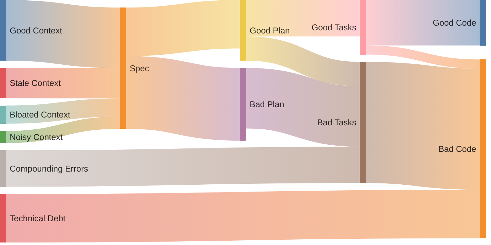

# Context Engineering for AI-Assisted Development

Context engineering is the practice of structuring information to maximize AI effectiveness. Without it, [context rot](#context-rot) degrades model performance unpredictably as input grows. These principles help you get better results from AI coding assistants.

## The 5 Core Principles

### 1. Filesystem as External Memory

Context windows have limits. Treat the filesystem as unlimited memory:

- **Store large content in files** - Don't paste entire codebases into chat
- **Keep only references in context** - Use file paths, not full contents
- **Agent can "look up" information** - Point to files when needed

```
_plans/
  plan.md          # Current goals and status
  research.md      # Findings and sources
  decisions.md     # Architectural choices with rationale
```

### 2. Attention Manipulation Through Repetition

After many interactions, AI may "forget" original goals ("lost in the middle" effect).

**Solution:** Keep a plan file that gets RE-READ throughout execution:

```
Start of context: [Original goal - far away, attention fades]
...many interactions...
End of context: [Recently read plan.md - gets ATTENTION!]
```

By reading the plan before major decisions, goals appear in the attention window.

### 3. Keep Failure Traces

Error recovery is one of the clearest signals of true agentic behavior.

**KEEP failed actions visible:**

```markdown
## Errors Encountered
- FileNotFoundError: config.json not found → Created default config
- API timeout → Retried with exponential backoff, succeeded
```

The model updates its internal understanding when seeing failures and their resolutions.

### 4. Avoid Few-Shot Overfitting

Uniformity breeds fragility. Repetitive patterns cause drift and hallucination.

**Introduce controlled variation:**
- Vary phrasings slightly
- Don't copy-paste patterns blindly
- Recalibrate on repetitive tasks

### 5. Stable Prefixes for Cache Optimization

AI assistants are input-heavy (100:1 input-to-output ratio). Structure for efficiency:

- **Put static content FIRST** - Instructions, context that doesn't change
- **Append-only context** - Never modify history mid-conversation
- **Consistent formatting** - Same structure helps caching

---

## Context Window Management

### Quality Degrades Before Limits

:::warning
Quality starts to degrade well before you hit context limits. Signs of degradation:
- Responses become less coherent
- Model forgets earlier context
- Hallucinations increase
:::

### Fresh Conversation Reset

When context gets bloated:
1. Copy everything important
2. Start a fresh conversation
3. Paste back only what matters

Fresh context with critical information preserved works better than struggling through degraded context.

### When to Restart vs Continue

**Restart when:**
- Conversation has gone off the rails
- Accumulated irrelevant context
- Quality is noticeably degraded
- Switching to a different task

**Continue when:**
- Building on previous work coherently
- Context is still relevant and focused
- Quality remains good

---

## Context Rot

Context rot is the non-uniform performance degradation that occurs as input context expands. Unlike a gradual decline, models exhibit **sharp, unpredictable drops** at certain thresholds — a model might maintain 95% accuracy, then suddenly plummet to 60%.

Research across [18 leading LLMs](https://research.trychroma.com/context-rot) (GPT-4.1, Claude 4, Gemini 2.5, Qwen 3) confirms all models are affected.

### How It Manifests

- **Lost in the Middle** — models excel at beginning/end positions, neglect middle. Accuracy drops 15-20 points purely from information position
- **Attention Degradation** — adding more tokens to "improve" context actually worsens performance. Chain-of-thought can even degrade in long-context tasks
- **Cascading Effect** — stale context compounds through each stage of the development pipeline:



### Types of Context Rot

| Type | Description | Example |
|------|-------------|---------|
| **Temporal** | Time-sensitive info becomes stale | Outdated API docs, changed requirements |
| **Structural** | Relationships between entities shift | Refactored code, moved files |
| **Semantic** | Meaning changes even if data doesn't | Renamed concepts, evolved terminology |

### Prevention

:::tip
- **Prune aggressively** — remove resolved errors, completed phases, irrelevant history
- **Summarize, don't accumulate** — compress long conversations into concise summaries
- **Position critical info at boundaries** — place key information at the beginning or end of context
- **Use filesystem as memory** — offload to files instead of stuffing the context window (see [Principle 1](#1-filesystem-as-external-memory))
- **Re-read plans regularly** — counteract attention fade (see [Principle 2](#2-attention-manipulation-through-repetition))
- **Fresh conversation reset** — when degradation sets in, start clean with only essential context
:::

---

## Practical Patterns

### Planning File Template

```markdown
# Plan: [Brief Description]

## Goal
[One sentence describing the end state]

## Phases
- [ ] Phase 1: [Description]
- [ ] Phase 2: [Description]
- [ ] Phase 3: [Description]

## Status
**Current:** [What's happening now]

## Decisions
- [Decision]: [Rationale]

## Errors Encountered
- [Error]: [Resolution]
```

### Error Logging Format

```markdown
## Errors Encountered
- [Error message or type]
  → [What was tried]
  → [Resolution or workaround]
```

### Decision Documentation

```markdown
## [Decision Title]
**Status:** Decided | Pending

**Options:**
1. [Option A] - [Pros/Cons]
2. [Option B] - [Pros/Cons]

**Choice:** [Selected option]
**Rationale:** [Why this was chosen]
```

---

## Planning with Files Workflow

For complex tasks, use the [Planning with Files](/customizations/skills/planning-with-files) skill to persist context across sessions.

### Directory Convention

```
_plans/
  2026-01-08-dark-mode-toggle/
    plan.md
    decisions.md
  2026-01-09-api-auth-refactor/
    plan.md
    research.md
```

**Naming:** `YYYY-MM-DD-task-name` (kebab-case)

### File Types

| Type | When to Create | Content |
|------|----------------|---------|
| `plan.md` | Always | Goal, phases, status, errors |
| `research.md` | Research-heavy tasks | Sources, findings |
| `decisions.md` | Tradeoff decisions | Options, rationale |
| `scratch.md` | Complex reasoning | Drafts, working notes |

### File Type Selection

| Task Type | Files |
|-----------|-------|
| Simple bug fix | `plan.md` |
| Feature with tradeoffs | `plan.md` + `decisions.md` |
| Research/investigation | `plan.md` + `research.md` |
| Complex refactor | All types |

### Critical Rules

:::info
1. **Store, Don't Stuff** — Large outputs go to files, not context
2. **Log All Errors** — Every error in plan.md "Errors Encountered"
3. **Decisions Need Rationale** — Record WHY, not just what
4. **Update Status Immediately** — Mark phases complete as done
5. **Refresh Goals** — Re-read plan.md after ~20+ interactions
:::

---

## Key Statistics

| Metric | Insight |
|--------|---------|
| Average interactions per complex task | ~50 |
| Input-to-output ratio | 100:1 |
| Quality degradation threshold | 20-40% of context used |

---

## Summary

> "If the model improvement is the rising tide, we want our workflow to be the boat, not the piling stuck on the seafloor."

The best AI workflows adapt to leverage model improvements while maintaining solid engineering practices around context management.
