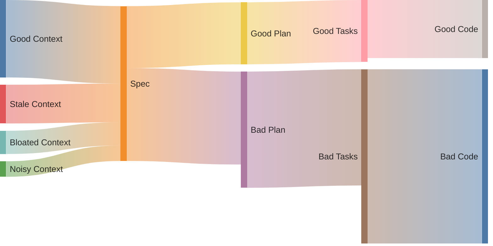

# Context engineering for AI-assisted development

Context engineering is giving the AI the right information at the right time. That's it. Curate what the model sees, get better results.

Why does this matter? Because AI coding assistants don't actually "know" your codebase. They only know what's in front of them right now. Feed them garbage context, get garbage output. Feed them focused, relevant context, and they'll surprise you.

This guide covers what goes wrong (context rot), how to fight it, and practical patterns that work.

---

## Context rot: the inevitable problem

Here's the uncomfortable truth: your context will rot. Not if. When.

Context rot is the performance degradation that happens as your conversation grows. It's not a gradual decline either. Models can maintain 95% accuracy, then suddenly plummet to 60% when you cross some invisible threshold. Sharp drops, not gentle slopes.

[Research across 18 leading LLMs](https://research.trychroma.com/context-rot) (GPT-4.1, Claude 4, Gemini 2.5, Qwen 3) confirms every model is affected. This isn't a bug in one tool. It's how attention mechanisms work.

### Why it happens

LLMs have a "lost in the middle" problem. They're great at remembering the beginning and end of conversations. The middle? Not so much. Accuracy drops 15-20 points purely based on where information appears in the context window.

And here's the annoying part: adding more context to "help" often makes things worse. More tokens means more places for attention to scatter. Chain-of-thought reasoning can actually degrade on long-context tasks.

### What it looks like in practice

You'll know context rot when you see it:

| Scenario | What rots | What you'll see |
|----------|-----------|-----------------|
| Multi-file refactor | Earlier file changes fade | You renamed `UserService` to `AccountService` in file 1. By file 5, the agent calls it `CustomerService`. |
| Long debug session | Original error description | You said the bug is in the cache layer. 40 messages later, it's debugging the database. |
| Spec changes mid-task | Old and new requirements coexist | PM changed the requirements. Agent still builds the old spec while partially acknowledging the new one. |
| Research then implement | Research findings | It found three useful Stack Overflow answers. Forgot all of them when writing code. |
| Multi-day task | Yesterday's decisions | Made an architectural choice Tuesday. Wednesday it makes the opposite choice. |

### Signs you're experiencing it

- Agent asks questions you already answered
- It suggests approaches you explicitly rejected
- Hallucinations creep into otherwise solid responses
- It contradicts its own earlier work
- Responses become vague or generic

### Types of rot

| Type | What happens | Example |
|------|--------------|---------|
| Temporal | Time-sensitive info goes stale | Outdated API docs, changed requirements |
| Structural | Relationships between things shift | Refactored code, moved files |
| Semantic | Meaning changes even if words don't | Renamed concepts, evolved terminology |

### How rot compounds

Bad context doesn't just hurt one step. It cascades through your entire workflow:



A slightly stale spec produces a mediocre plan. A mediocre plan produces scattered tasks. Scattered tasks produce buggy code. Each stage amplifies the previous problem.

---

## Managing your context window

Quality degrades before you hit limits. You won't get a warning.

:::warning
Watch for these signs of degradation:
- Responses become less coherent
- Model forgets earlier context
- Hallucinations increase
- Agent seems to "drift" from the goal
:::

### The fresh start technique

When context gets bloated:

1. Copy everything important (current state, key decisions, blockers)
2. Start a fresh conversation
3. Paste back only what matters

This sounds wasteful. It's not. A fresh context with condensed critical information beats a degraded context every time.

### When to restart vs continue

Restart when:
- Conversation has gone off the rails
- You've accumulated context that's no longer relevant
- Quality is noticeably degraded
- Switching to a different task

Continue when:
- Building coherently on previous work
- Context is still focused and relevant
- No signs of degradation

---

## Five principles to combat context rot

These aren't abstract ideas. Each one directly fights a specific type of rot.

### 1. Use files as your agent's notebook

Context windows have limits. The filesystem doesn't.

Store large content in files, not chat. Keep references in context, not full contents. Let the agent look things up when needed.

```
_plans/
  plan.md          # Current goals and status
  research.md      # Findings and sources
  decisions.md     # Choices and why you made them
```

This fights context bloat. Instead of cramming everything into the conversation, externalize it.

### 2. Re-read your plan so the agent remembers

After many interactions, original goals fade. The "lost in the middle" effect buries them.

Keep a plan file. Have it re-read before major decisions:

```
Start of context: [Original goal - attention has faded]
...many interactions...
End of context: [Recently read plan.md - fresh attention!]
```

Reading the plan moves goals back into the attention window. Simple but effective.

### 3. Keep your failures visible

Error recovery shows whether an agent is actually reasoning or just pattern-matching.

Log failed attempts where the agent can see them:

```markdown
## Errors encountered
- FileNotFoundError: config.json not found → Created default config
- API timeout → Retried with exponential backoff, succeeded
```

The model updates its understanding when it sees what didn't work. This prevents the "try the same failing approach three times" loop.

### 4. Vary your patterns

Uniformity breeds fragility. When you copy-paste the same patterns repeatedly, the model starts overfitting to them. Drift and hallucination follow.

Break the monotony:
- Vary phrasings slightly
- Don't duplicate patterns blindly
- Recalibrate the agent on repetitive tasks

### 5. Structure for cache efficiency

AI assistants process way more input than they generate (roughly 100:1 ratio). Structure your context to help:

- Put static content first (instructions, unchanging context)
- Append-only conversation history (don't edit earlier messages)
- Consistent formatting (helps caching)

---

## Context engineering in GitHub Copilot

Copilot has specific mechanisms for managing context. Here's how they map to the principles above.

### Context layers

| Layer | Location | When loaded | Who decides |
|-------|----------|-------------|-------------|
| Project instructions | `.github/copilot-instructions.md` | Always | System |
| Agent memory | `AGENTS.md` | Always | System |
| Scoped instructions | `.github/instructions/*.instructions.md` | When matching files open | System (by pattern) |
| Prompts | `.github/prompts/*.prompt.md` | On demand via `/name` | You |
| Agents | `.github/agents/*.agent.md` | On demand via `@name` | You/System |
| Skills | `.github/skills/<name>/SKILL.md` | When AI thinks it's relevant | AI |

More context interfaces means more space consumed. Be strategic about what you configure.

See [customizations](/category/customizations/) for detailed setup of each layer.

---

## Planning with files workflow

For complex tasks, use the [Planning with Files](/customizations/skills/planning-with-files) skill to persist context across sessions.

### Rules that actually matter

:::info
1. Store, don't stuff. Large outputs go to files, not context.
2. Log every error. Failed attempts in `plan.md` prevent loops.
3. Record why, not just what. Decisions without rationale are useless later.
4. Update status immediately. Mark complete as you go.
5. Re-read after ~20 interactions. Refresh goals before the agent forgets them.
:::

---

## Caveats

### This isn't really engineering

"Context engineering" sounds precise. It's not.

Once the agent gets your instructions, execution depends on how well the model interprets them. You can increase the probability of good results. You cannot guarantee them.

Don't fall for phrases like "ensure it does X" or "prevent hallucinations." LLMs are probabilistic. Choose the right level of oversight for the task.

### Sharing context configurations

People love sharing their setups. Careful with that.

Problems with borrowed configs:
- The sharer's codebase is different from yours
- There's a tendency to overengineer upfront (build gradually instead)
- Different experience levels need different guidance
- If you don't know what's in your context, you'll blame the agent for following your own instructions

Build your context configuration iteratively. Start minimal. Add rules when you actually hit problems.

---

## Sources

- Böckeler, Birgitta. "[Context Engineering for Coding Agents](https://martinfowler.com/articles/exploring-gen-ai/context-engineering-coding-agents.html)." Martin Fowler, February 2026.
- Chroma Research. "[Context Rot in LLMs](https://research.trychroma.com/context-rot)." 2025.
