import HeroBanner from '@site/src/components/HeroBanner';

<HeroBanner />

## Resources

Official VS Code documentation for GitHub Copilot features and customization.

| Resource | Summary |
|----------|---------|
| [Copilot Features Cheat Sheet](https://code.visualstudio.com/docs/copilot/reference/copilot-vscode-features) | Complete reference: chat interfaces, inline suggestions, context controls, agents |
| [Chat Sessions](https://code.visualstudio.com/docs/copilot/chat/chat-sessions) | Session lifecycle, checkpoints, rollback, export as JSON or `.prompt.md` |
| [Chat Context](https://code.visualstudio.com/docs/copilot/chat/copilot-chat-context) | `#`-mentions, `@`-participants, workspace indexing, context window visualization |
| [Chat Tools](https://code.visualstudio.com/docs/copilot/chat/chat-tools) | Built-in, MCP, and extension tools; approval system, sandboxing, security |
| [Smart Actions](https://code.visualstudio.com/docs/copilot/copilot-smart-actions) | 15 integrated actions: commits, PRs, merge conflicts, docs, tests, rename |
| [Context Engineering Guide](https://code.visualstudio.com/docs/copilot/guides/context-engineering-guide) | Curate context → create plans → generate code; project docs as AI memory |
| [Prompt Engineering Guide](https://code.visualstudio.com/docs/copilot/guides/prompt-engineering-guide) | Practical tips for effective prompts in inline suggestions and chat |
| [Prompt Engineering for Copilot Chat](https://docs.github.com/en/copilot/concepts/prompting/prompt-engineering) | GitHub official guide: effective prompts, examples, breaking down tasks, avoiding ambiguity |
| [Copilot CLI Best Practices](https://docs.github.com/en/copilot/how-tos/copilot-cli/cli-best-practices) | Strategies for Copilot CLI: customization, planning, delegation, team workflows |
| [Custom Instructions](https://code.visualstudio.com/docs/copilot/customization/custom-instructions) | `AGENTS.md`, `copilot-instructions.md`, `/init` for workspace-tailored guidelines |
| [Customization Overview](https://code.visualstudio.com/docs/copilot/customization/overview) | Layers: instructions → skills → prompts → agents → MCP → model selection |
| [Prompt Files](https://code.visualstudio.com/docs/copilot/customization/prompt-files) | `.prompt.md` templates with YAML frontmatter, dynamic variables, tool integration |
| [Custom Agents](https://code.visualstudio.com/docs/copilot/customization/custom-agents) | `.agent.md` personas with handoff system, scoped tool access |
| [Agent Skills](https://code.visualstudio.com/docs/copilot/customization/agent-skills) | `SKILL.md` packages, progressive loading, portable via agentskills.io standard |
| [Subagents](https://code.visualstudio.com/docs/copilot/agents/subagents) | Isolated context windows for parallel tasks, token-efficient delegation |
| [Agents Tutorial](https://code.visualstudio.com/docs/copilot/agents/agents-tutorial) | Local → Background → Cloud agents; planning-first approach |
| [Background Agents](https://code.visualstudio.com/docs/copilot/agents/background-agents) | Autonomous CLI-based execution in Git worktrees, no supervision required |

## Study Guide

A structured learning path from fundamentals to advanced customization.

```mermaid
graph LR
    P1["🧭 Phase 1: Understand the Platform
    Features, Sessions, Context, Tools, Smart Actions"]
    P2["🧠 Phase 2: Context Engineering & Prompting
    Curate → Plan → Generate, Reasoning Patterns"]
    P3["📏 Phase 3: Define Standards
    Code, Tests, Git, Reviews"]
    P4["⚙️ Phase 4: Automate
    Prompts → Agents → Skills"]
    P5["🚀 Phase 5: Scale with Agents
    Subagents, Background, Cloud"]
    P6["🔄 Phase 6: Reflect & Iterate
    Session Analysis → Improve"]

    P1 --> P2 --> P3 --> P4 --> P5 --> P6
    P6 -.->|feedback loop| P3
```

### Phase 1: Understand the Platform

Start by learning what Copilot can do and how it processes context — this is the foundation everything else builds on.

1. **[Copilot Features Cheat Sheet](https://code.visualstudio.com/docs/copilot/reference/copilot-vscode-features)** — Get oriented. Know what's available: chat views, inline suggestions, smart actions, context controls.
2. **[Chat Sessions](https://code.visualstudio.com/docs/copilot/chat/chat-sessions)** + **[Chat Context](https://code.visualstudio.com/docs/copilot/chat/copilot-chat-context)** — Understand how sessions work and how Copilot gathers context. This is the mental model for everything that follows.
3. **[Chat Tools](https://code.visualstudio.com/docs/copilot/chat/chat-tools)** — Learn the tool system (built-in, MCP, extensions) and approval model.
4. **[Smart Actions](https://code.visualstudio.com/docs/copilot/copilot-smart-actions)** — Built-in actions for commits, docs, tests, conflict resolution — use these before building custom solutions.

### Phase 2: Context Engineering & Prompting

:::tip[Key Insight]
The single most important skill for effective AI-assisted development. Poor context = poor output.
:::

5. **[Context Engineering Guide](https://code.visualstudio.com/docs/copilot/guides/context-engineering-guide)** — Official VS Code guide: curate context → create plans → generate code.
6. **[Context Engineering](./guides/context-engineering)** — Manus-inspired principles: filesystem as memory, plan repetition, failure traces, cache optimization.
7. 📺 **[Subagents: Parallel Execution and Context Isolation](https://www.youtube.com/watch?v=GMAoTeD9siU)** — How subagents enable isolated context windows for parallel tasks.
8. **[AI Coding Best Practices](./guides/ai-coding-best-practices)** — Plan architecture upfront, tell AI what NOT to do, use different modes strategically.
9. **[Custom Instructions](https://code.visualstudio.com/docs/copilot/customization/custom-instructions)** — Set up `AGENTS.md` and `copilot-instructions.md`; use `/init` to bootstrap workspace guidelines.
10. **[Prompt Engineering Guide](https://code.visualstudio.com/docs/copilot/guides/prompt-engineering-guide)** — Practical tips for writing effective prompts for inline suggestions and chat.
11. **[Prompt Engineering for Copilot Chat](https://docs.github.com/en/copilot/concepts/prompting/prompt-engineering)** — GitHub official guide: effective prompts, examples, breaking down complex tasks.
12. **[Reasoning Strategies](./guides/reasoning-strategies)** — Eight named patterns (CoT, ToT, AoT, Reflexion...) and when to use each.

### Phase 3: Define Your Standards

Before automating anything, define what "good" looks like for your team.

13. **[Coding Guidelines](./customizations/instructions/coding-guidelines)** — C# patterns, code organization conventions.
14. **[Coding Style](./customizations/instructions/coding-style)** — Formatting and naming conventions.
15. **[Testing (xUnit)](./customizations/instructions/testing-xunit)** — Test patterns, fixtures, assertions.
16. **[Git Messages](./customizations/instructions/git-message)** — Commit message format and conventions.
17. **[Code Review](./customizations/agents/code-review)** — Code review agent with prioritized feedback.

### Phase 4: Automate with Customizations

Now encode your standards into reusable prompts, agents, and skills.

18. **[Customization Overview](https://code.visualstudio.com/docs/copilot/customization/overview)** — Understand the layering: instructions → skills → prompts → agents → MCP.
19. **[Prompt Files](https://code.visualstudio.com/docs/copilot/customization/prompt-files)** — Learn `.prompt.md` format, then study handbook prompts:
    - [Commit](./customizations/prompts/commit) — Conventional commits with emoji categorization
    - [Pros and Cons](./customizations/prompts/pros-and-cons) — Decision analysis framework
    - [Session Reflection](./customizations/prompts/reflect) — Capture session learnings
20. **[Custom Agents](https://code.visualstudio.com/docs/copilot/customization/custom-agents)** — Learn `.agent.md` format, then study handbook agents:
    - [Debug](./customizations/agents/debug) — 4-phase systematic debugging
    - [Research](./customizations/agents/research) — Recursive exploration with source analysis
    - [Differ](./customizations/agents/differ) — Git branch diff summaries
    - [Spec Interview](./customizations/agents/spec) — Structured requirement gathering with plan handoff
    - [Code Review](./customizations/agents/code-review) — Prioritized review (Critical → Low)
21. **[Agent Skills](https://code.visualstudio.com/docs/copilot/customization/agent-skills)** — Learn `SKILL.md` format, then study handbook skills:
    - [.NET Run File](./customizations/skills/dotnet-run-file) — Execute C# scripts directly
    - [.NET Test](./customizations/skills/dotnet-test) — Selective test execution
    - [.NET Dependency](./customizations/skills/dotnet-dependency) — NuGet dependency management
    - [Planning with Files](./customizations/skills/planning-with-files) — Persistent task tracking

### Phase 5: Scale with Agents

Delegate complex, multi-step work to autonomous agents.

22. **[Subagents](https://code.visualstudio.com/docs/copilot/agents/subagents)** — Isolated context for parallel delegation.
23. **[Agents Tutorial](https://code.visualstudio.com/docs/copilot/agents/agents-tutorial)** — Build Local → Background → Cloud agent workflows.
24. **[Background Agents](https://code.visualstudio.com/docs/copilot/agents/background-agents)** — Autonomous execution in worktrees.
25. **[Copilot CLI Best Practices](https://docs.github.com/en/copilot/how-tos/copilot-cli/cli-best-practices)** — Strategies for CLI agent workflows: customization, planning, delegation.

### Phase 6: Reflect & Iterate

Close the feedback loop. The best setups evolve continuously.

26. **[Session Reflection](./guides/session-reflection)** — Meta-analysis of how work was done, not what was built.
27. Use `/reflect` after complex sessions → accumulate insights → extract patterns into new instructions, prompts, or skills.
